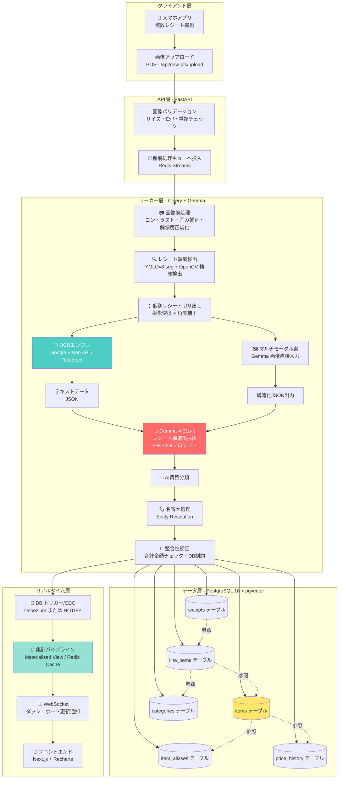
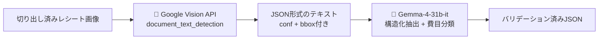
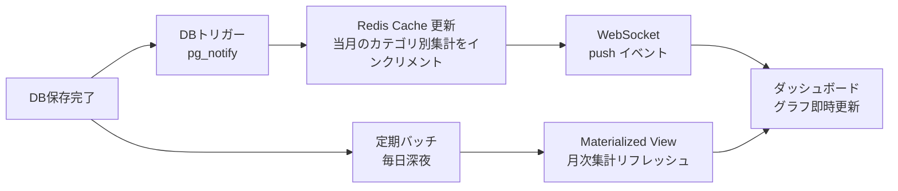
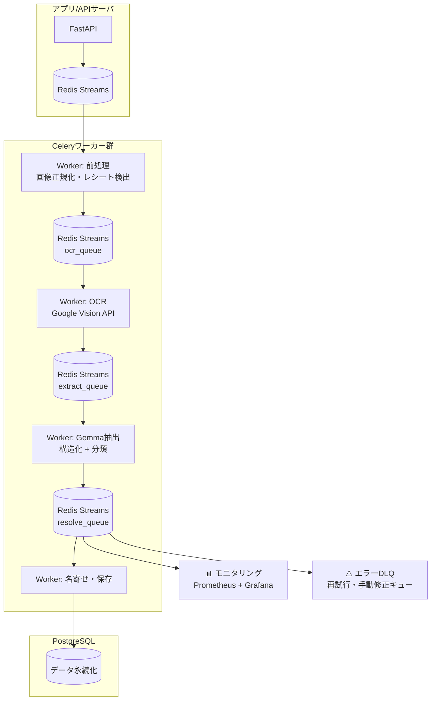
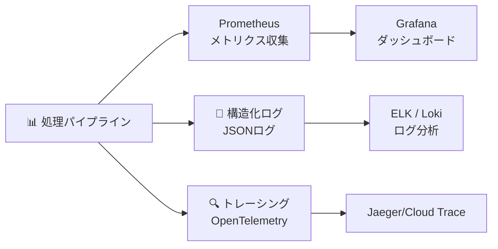

# 次世代家計簿アプリ 全体処理パイプライン設計
> **現行実装との対応**: この文書は将来構成を含む設計案です。現在は静的HTML/Vanilla JS + FastAPI + OpenRouter + Firestore + 非公開Cloud Storageで、Googleアカウントごとに独立した家計簿と招待共有を運用します。既定モデルは`google/gemini-2.5-flash-lite`で、画像から文字認識・構造化・分類を1回のマルチモーダル呼び出しで行います。PostgreSQL、Redis/Celery、独立OCR、Next.js/WebSocketは未導入です。現行仕様は`00_現行実装仕様.md`を参照してください。

## 1. システム概要（将来構成の設計案）

ユーザーがスマートフォンで撮影した「複数枚のレシートが写った画像」をAIで解析し、品目別の価格推移や月次の支出を自動でダッシュボード化するシステムの全体処理フローを設計する。

```
【中核技術スタック】
- AIモデル        : google/gemma-4-31b-it（テキストモデル + OCRエンジン併用）
- OCRエンジン     : Google Cloud Vision API / Tesseract 5 (LSTM)
- データベース    : PostgreSQL 16
- ベクトル検索    : pgvector (PostgreSQL拡張)
- メッセージング  : Redis Streams / RabbitMQ
- バックエンド    : FastAPI (Python 3.12) + Celery
- フロントエンド  : Next.js 14 + Recharts（リアルタイム更新はWebSocket）
```

## 2. 全体フロー図（Mermaid）



## 3. 処理ステップ詳細

### Step 1: 画像アップロード（0〜2秒）

| 項目 | 仕様 |
|------|------|
| API | `POST /api/receipts/upload` (multipart/form-data) |
| バリデーション | 画像形式 (JPEG/PNG/HEIC→JPEG変換)、5MB以下、解像度 800px~8000px |
| 重複チェック | 画像ハッシュ (perceptual hash) による同一画像の再アップロード防止 |
| 応答 | `202 Accepted` + `upload_id` を即時返却（非同期処理） |

### Step 2: 画像前処理（0.5〜2秒）

```python
# 前処理パイプライン
def preprocess_image(image: np.ndarray) -> np.ndarray:
    # 1. グレースケール化
    gray = cv2.cvtColor(image, cv2.COLOR_BGR2GRAY)
    
    # 2. 適応的二値化（ムラ照明対策）
    binary = cv2.adaptiveThreshold(
        gray, 255, 
        cv2.ADAPTIVE_THRESH_GAUSSIAN_C, 
        cv2.THRESH_BINARY, 11, 2
    )
    
    # 3. ノイズ除去（メディアンフィルタ）
    denoised = cv2.medianBlur(binary, 3)
    
    # 4. 射影変換準備（後の輪郭検出用）
    return denoised
```

### Step 3: レシート領域検出と切り出し（1〜3秒）

**アプローチ: YOLOv8-seg（セグメンテーション）＋ OpenCV 後処理のハイブリッド**

1. **YOLOv8-seg** でレシート領域のセグメンテーションマスクを推定
   - 学習データ: 独自に収集した「複数レシートがランダム配置された写真」5000枚以上
   - アノテーション: レシートの4隅ポリゴン（rotated bounding box）
2. **OpenCV の `findContours` + `approxPolyDP`** で四角形候補を抽出
   - 面積フィルタ: 画像全体の5%以上
   - 長方形度フィルタ: `4角がすべて約90° ± 10°`
3. **射影変換（ホモグラフィ）**で各レシートを正面から見た長方形に補正
4. **1枚の画像内のレシートが重なっている場合**:
   - YOLOv8-seg のインスタンスセグメンテーションで重なりを分離
   - 重なり率が高い場合は手動分割をユーザーに促す（UIで四隅指定）

```python
def extract_receipts(image: np.ndarray) -> list[np.ndarray]:
    """複数レシートを個別に切り出す"""
    segments = yolo_seg.predict(image)  # YOLOv8-seg
    
    receipts = []
    for seg in segments:
        # 四角形の輪郭に近似
        contour = approx_polygon(seg.mask)
        
        # 射影変換で正面に補正
        warped = perspective_transform(image, contour)
        
        # クリーンアップ（背景除去・角度補正）
        receipts.append(warped)
    
    return receipts
```

### Step 4: OCR（テキストモデル利用の場合の前段）（2〜5秒）

**推奨: 各切り出しレシートに対してOCRエンジンを実行し、テキストをGemmaに入力するアプローチ**

#### なぜテキストモデル + OCR がベストプラクティスか

| 観点 | OCR + Gemma（テキスト） | Gemma マルチモーダル（画像直接） |
|------|--------------------------|-------------------------------|
| 精度 | ⭐⭐ トークン制限(8K-32K)に依存しない | ⭐ 画像トークン化で解像度制限（~1024px） |
| コスト | 低（Vision API ~$1.5/1000枚） | 高（画像トークンはテキストの約10倍） |
| 誤差 | OCR誤りをGemmaの言語モデルが補正可能 | 低解像度レシートは文字が潰れる |
| レイテンシ | 2-5秒（並列OCRで短縮可能） | 1-3秒 |
| 回転・歪み | 前処理で補正済みならOK | 大きな回転は苦手 |
| スケール | テキストはキャッシュ・再処理容易 | 画像の再送コストが高い |

**結論: OCRエンジン（Google Vision API 推奨）→ テキスト → Gemma-4-31b-it で構造化抽出する2段構成を採用する。**



### Step 5: Gemma-4-31b-it による構造化抽出（3〜10秒/レシート）

- **入力**: OCRテキスト + システムプロンプト（Few-shot）
- **出力**: 厳密なJSONスキーマに従った構造化データ
- **工夫点**:
  1. `response_format: json` を使いバリデーション
  2. **Confidence-based リトライ**:
     - OCRのconf < 0.7 の文字列が含まれる場合は、その部分を`[UNKNOWN]`タグで囲みGemmaに補完させる
     - 例: `[UNKNOWN]コカ・コーラ 500ml[/UNKNOWN] ... ¥150`
  3. **複数レシートの一括処理**: 切り出した各レシートを並列でGemmaに投げ、結果をマージ
  4. **金額整合性チェック**: 抽出した`line_items`の合計と`total_amount`が一致しない場合は再プロンプト（最大2回）

### Step 6: AI費目分類（Step 5と同時実行）

Gemmaに費目分類も同時に実行させる。詳細は「02_Gemma最適化プロンプト」参照。

### Step 7: 名寄せ（Entity Resolution）（0.5〜2秒）

- `pgvector` のベクトル類似度検索 + LLM後処理 + 正規化ルールの複合アプローチ
- 詳細は「04_名寄せアルゴリズム設計」参照

### Step 8: データベース保存（0.1〜1秒）

```python
# トランザクションで原子的に保存
async with db.transaction():
    receipt = await Receipt.create(
        upload_id=upload_id,
        image_key=s3_key,
        store_name=extracted.store,
        purchased_at=extracted.datetime,
        total_amount=extracted.total,
        ocr_confidence=ocr_conf,
        model_version="gemma-4-31b-it-2026.08"
    )
    
    for item in extracted.items:
        # 名寄せ済みアイテムを取得/作成
        canonical_item = await resolve_item(item.name, item.price)
        
        line_item = await LineItem.create(
            receipt_id=receipt.id,
            item_id=canonical_item.id,
            category_id=resolved_category.id,
            quantity=item.qty,
            unit_price=item.unit_price,
            amount=item.amount
        )
        
        # 価格履歴を保存
        await PriceHistory.create(
            item_id=canonical_item.id,
            receipt_id=receipt.id,
            unit_price=item.unit_price,
            purchased_at=extracted.datetime
        )
```

### Step 9: ダッシュボード更新通知（0.1秒以内）

**アプローチ: インメモリ集計（リアルタイム） + バッチ集計（履歴）のハイブリッド**



**集計クエリ例（リアルタイム用）:**

```sql
-- 月次・カテゴリ別支出（キャッシュ&集計ビュー）
CREATE MATERIALIZED VIEW monthly_spending_by_category AS
SELECT 
    DATE_TRUNC('month', r.purchased_at) AS month,
    li.category_id,
    c.name AS category_name,
    SUM(li.amount) AS total_amount,
    COUNT(DISTINCT r.id) AS receipt_count
FROM line_items li
JOIN receipts r ON r.id = li.receipt_id
JOIN categories c ON c.id = li.category_id
GROUP BY 1, 2, 3;

-- 商品の価格推移（ダッシュボード用）
CREATE MATERIALIZED VIEW item_price_trend AS
SELECT 
    item_id,
    DATE_TRUNC('month', purchased_at) AS month,
    AVG(unit_price) AS avg_price,
    PERCENTILE_CONT(0.5) WITHIN GROUP (ORDER BY unit_price) AS median_price,
    COUNT(*) AS purchase_count
FROM price_history
GROUP BY 1, 2
ORDER BY item_id, month;
```

## 4. 非同期処理アーキテクチャ



- **Redis Streams** 採用理由: Consumer Group による並列処理、メッセージの永続化、処理遅延の監視が容易
- **エラーハンドリング**: 3回リトライ → DLQ (Dead Letter Queue) へ → 管理者が目視確認
- **スケーリング**: レシート数に応じてワーカーを水平スケール（k8s HPA）

## 5. 性能・信頼性要件

| 指標 | ターゲット | 実現手段 |
|------|-----------|---------|
| 画像投入→ダッシュボード反映 | 30秒以内 | 非同期パイプライン + WebSocket |
| レシート切り出し精度 | 95%以上 | YOLOv8-seg + OpenCV 検証 |
| 品目抽出精度 (F1) | 90%以上 | Few-shotプロンプト + 整合性検証 |
| 費目分類精度 | 92%以上 | カテゴリ + 単価の文脈利用 |
| 名寄せ精度 (正解率) | 85%以上 | ベクトル + LLM + ルールの複合系 |
| 同時実行 | 100ジョブ/秒 | Celery ワーカー自動スケール |
| 可用性 | 99.9% | マルチAZ PostgreSQL + S3 + CDN |

## 6. 運用・監視



**監視項目**:
- 各ステージの処理時間（p50 / p95）
- Gemma API エラー率・レイテンシ
- OCR confidence の分布
- 名寄せ精度（サンプリング監査）
- DLQ の滞留数（アラート）

## 7. セキュリティ・プライバシー

| 観点 | 対策 |
|------|------|
| TLS/暗号化 | 転送中TLS1.3、保管時AES-256（KMS） |
| PII | クレジットカード番号等のマスキング（OCR後パターンマッチ） |
| 画像保管 | 利用者IDごとにS3キー分割、署名付きURL期限付き |
| AI出力 | JSONスキーマバリデーション、プロンプトインジェクション対策 |
| 監査 | 全処理の監査ログ（誰が・いつ・どの画像を処理したか） |