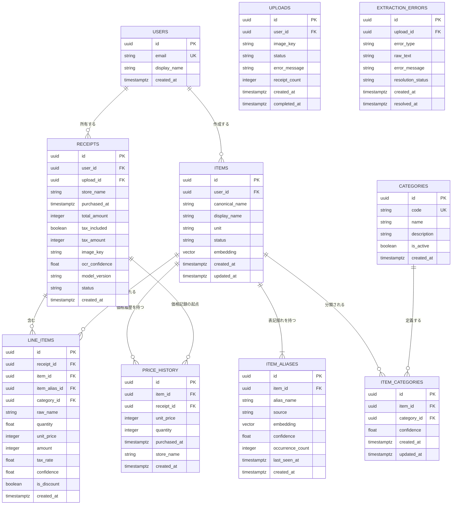
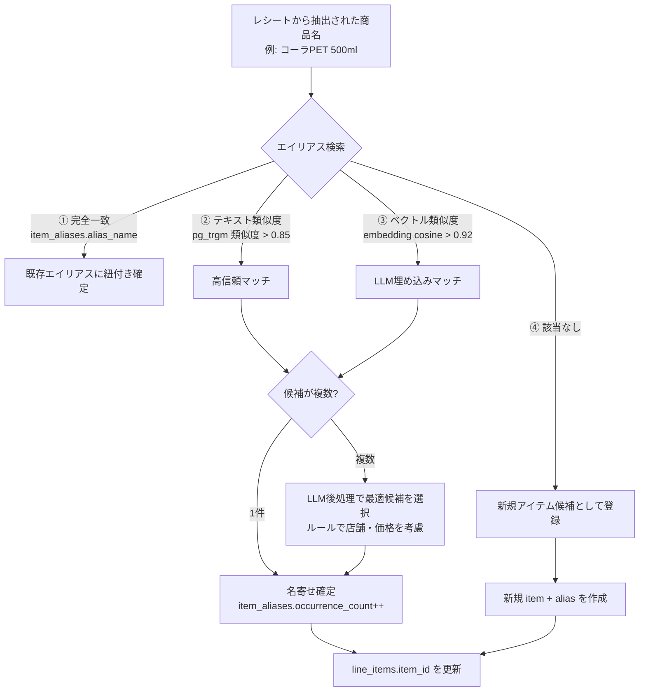
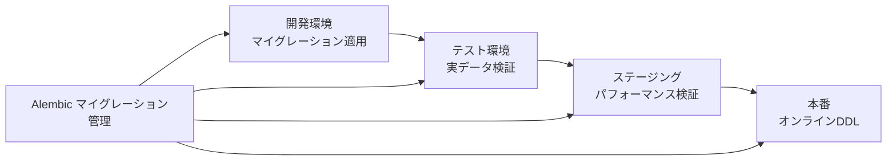

# データベーススキーマ設計（PostgreSQL 16 + pgvector）
> **現行実装との対応**: この文書は将来のPostgreSQL/pgvector構成案です。現在はFirestoreの`receipts`コレクションを家族共通の正本とし、商品マスタは明細から集計します。以下のDDLやRedisキャッシュは未導入です。現行仕様は`00_現行実装仕様.md`を参照してください。

## 1. 設計コンセプト

### 主要な設計思想

1. **正規化と非正規化のバランス**:
   - マスタデータ（items, categories）は厳密に正規化
   - 集計用にMaterialized ViewとRedisキャッシュを併用
2. **名寄せの柔軟性**: 
   - `items`（正規化された正式商品名）と `item_aliases`（表記揺れ実績）を分離
   - ベクトル埋め込みは `pgvector` で `item_aliases` に保存
3. **監査と再処理**:
   - 全テーブルに `created_at`, `updated_at` を付与
   - AI抽出は `confidence` を保持し、低信頼データを後から修正可能に
4. **時系列価格**:
   - `price_history` は追記型（イミュータブル）で保存し、価格推移の完全な履歴を保持

### ER図（Mermaid）



---

## 2. DDL（PostgreSQL 16）

### 2.1 拡張機能の有効化

```sql
-- ベクトル検索用拡張
CREATE EXTENSION IF NOT EXISTS vector;
CREATE EXTENSION IF NOT EXISTS pg_trgm;  -- 類似度検索
CREATE EXTENSION IF NOT EXISTS btree_gin;  -- 複合インデックス高速化

-- UUID生成
CREATE EXTENSION IF NOT EXISTS "pgcrypto";
```

### 2.2 ユーザーテーブル

```sql
CREATE TABLE users (
    id            UUID PRIMARY KEY DEFAULT gen_random_uuid(),
    email         VARCHAR(255) NOT NULL UNIQUE,
    display_name  VARCHAR(100) NOT NULL,
    created_at    TIMESTAMPTZ NOT NULL DEFAULT NOW(),
    updated_at    TIMESTAMPTZ NOT NULL DEFAULT NOW()
);

COMMENT ON TABLE users IS 'アプリ利用者';
```

### 2.3 アップロード管理テーブル

```sql
CREATE TABLE uploads (
    id             UUID PRIMARY KEY DEFAULT gen_random_uuid(),
    user_id        UUID NOT NULL REFERENCES users(id) ON DELETE CASCADE,
    image_key      VARCHAR(512) NOT NULL,  -- S3キー
    status         VARCHAR(20) NOT NULL DEFAULT 'pending'
                   CHECK (status IN ('pending', 'processing', 'completed', 'failed')),
    error_message  TEXT,
    receipt_count  INTEGER,
    created_at     TIMESTAMPTZ NOT NULL DEFAULT NOW(),
    completed_at   TIMESTAMPTZ
);

CREATE INDEX idx_uploads_user_id ON uploads(user_id, created_at DESC);
CREATE INDEX idx_uploads_status ON uploads(status) WHERE status = 'processing';
```

### 2.4 レシートテーブル

```sql
CREATE TABLE receipts (
    id              UUID PRIMARY KEY DEFAULT gen_random_uuid(),
    upload_id       UUID NOT NULL REFERENCES uploads(id) ON DELETE CASCADE,
    user_id         UUID NOT NULL REFERENCES users(id) ON DELETE CASCADE,
    store_name      VARCHAR(200) NOT NULL,
    purchased_at    TIMESTAMPTZ NOT NULL,
    total_amount    INTEGER NOT NULL CHECK (total_amount >= 0),
    tax_included    BOOLEAN NOT NULL DEFAULT true,
    tax_amount      INTEGER CHECK (tax_amount IS NULL OR tax_amount >= 0),
    currency        CHAR(3) NOT NULL DEFAULT 'JPY',
    image_key       VARCHAR(512),           -- 個別レシート切り出し画像
    ocr_confidence  REAL,                   -- OCR全体の平均信頼度
    model_version   VARCHAR(50),            -- Gemmaプロンプトのバージョン
    status          VARCHAR(20) NOT NULL DEFAULT 'extracted'
                    CHECK (status IN ('extracted', 'validated', 'review_required', 'corrected')),
    created_at      TIMESTAMPTZ NOT NULL DEFAULT NOW(),
    updated_at      TIMESTAMPTZ NOT NULL DEFAULT NOW()
);

-- インデックス
CREATE INDEX idx_receipts_user_purchased ON receipts(user_id, purchased_at DESC);
CREATE INDEX idx_receipts_store ON receipts(user_id, store_name);
CREATE INDEX idx_receipts_upload ON receipts(upload_id);

-- 作成日時自動更新
CREATE OR REPLACE FUNCTION set_updated_at()
RETURNS TRIGGER AS $$
BEGIN
    NEW.updated_at = NOW();
    RETURN NEW;
END;
$$ LANGUAGE plpgsql;

CREATE TRIGGER trg_receipts_updated_at
    BEFORE UPDATE ON receipts
    FOR EACH ROW EXECUTE FUNCTION set_updated_at();
```

### 2.5 カテゴリテーブル（費目マスタ）

```sql
CREATE TABLE categories (
    id          UUID PRIMARY KEY DEFAULT gen_random_uuid(),
    code        VARCHAR(30) NOT NULL UNIQUE,
    name        VARCHAR(50) NOT NULL,
    description VARCHAR(200),
    sort_order  INTEGER NOT NULL DEFAULT 0,
    is_active   BOOLEAN NOT NULL DEFAULT true,
    created_at  TIMESTAMPTZ NOT NULL DEFAULT NOW(),
    updated_at  TIMESTAMPTZ NOT NULL DEFAULT NOW()
);

-- 初期データ（固定費目）
INSERT INTO categories (code, name, description, sort_order) VALUES
    ('food',          '食費',     '食品・飲料（酒類除く）', 10),
    ('alcohol',       '酒類',     'アルコール飲料', 20),
    ('daily_goods',   '日用品',   '洗剤・紙製品・消耗品', 30),
    ('hygiene',       '衛生用品', '医薬品・衛生用品', 40),
    ('entertainment', '交際費',   '外食・贈答・交際', 50),
    ('housing',       '住居費',   '家賃・光熱費', 60),
    ('transport',     '交通費',   '電車・バス・タクシー', 70),
    ('other',         'その他',   'その他の支出', 999);
```

### 2.6 アイテム（正規化商品マスタ）テーブル

```sql
CREATE TABLE items (
    id             UUID PRIMARY KEY DEFAULT gen_random_uuid(),
    user_id        UUID NOT NULL REFERENCES users(id) ON DELETE CASCADE,
    canonical_name VARCHAR(200) NOT NULL,   -- 正式名称（例: コカ・コーラ 500ml PET）
    display_name   VARCHAR(200) NOT NULL,    -- 表示名（例: コーラ 500ml）
    brand          VARCHAR(100),             -- ブランド名
    unit           VARCHAR(20) DEFAULT '個', -- 単位（個/本/g/ml）
    status         VARCHAR(20) NOT NULL DEFAULT 'active'
                   CHECK (status IN ('active', 'merged', 'archived')),
    -- pgvector による商品名の埋め込みベクトル (日本語埋め込みモデル使用)
    embedding      VECTOR(1536),
    created_at     TIMESTAMPTZ NOT NULL DEFAULT NOW(),
    updated_at     TIMESTAMPTZ NOT NULL DEFAULT NOW(),
    UNIQUE (user_id, canonical_name)
);

-- ベクトル類似度検索用インデックス (IVFFlat)
CREATE INDEX idx_items_embedding ON items 
    USING ivfflat (embedding vector_cosine_ops) WITH (lists = 100);

-- 商品名の実テキスト類似度検索用
CREATE INDEX idx_items_canonical_trgm ON items USING gin (canonical_name gin_trgm_ops);

-- マージ先（mergedアイテムの統合先）を記録する列
ALTER TABLE items 
    ADD COLUMN merged_into_id UUID REFERENCES items(id),
    ADD COLUMN merged_at TIMESTAMPTZ;
```

### 2.7 アイテム別名（表記揺れ実績）テーブル

```sql
CREATE TABLE item_aliases (
    id               UUID PRIMARY KEY DEFAULT gen_random_uuid(),
    item_id          UUID NOT NULL REFERENCES items(id) ON DELETE CASCADE,
    alias_name       VARCHAR(200) NOT NULL,   -- 実際にレシートに記載された名前
    source           VARCHAR(50) NOT NULL DEFAULT 'receipt'
                     CHECK (source IN ('receipt', 'user', 'llm_cluster')),
    embedding        VECTOR(1536),            -- エイリアス名の埋め込み
    confidence       REAL NOT NULL DEFAULT 1.0 CHECK (confidence >= 0 AND confidence <= 1),
    occurrence_count INTEGER NOT NULL DEFAULT 1,  -- 出現回数
    last_seen_at     TIMESTAMPTZ NOT NULL DEFAULT NOW(),
    created_at       TIMESTAMPTZ NOT NULL DEFAULT NOW(),
    UNIQUE (item_id, alias_name)
);

-- エイリアスのベクトル検索インデックス
CREATE INDEX idx_item_aliases_embedding ON item_aliases
    USING ivfflat (embedding vector_cosine_ops) WITH (lists = 100);

-- 実テキスト類似度検索用
CREATE INDEX idx_item_aliases_name_trgm ON item_aliases USING gin (alias_name gin_trgm_ops);

-- 頻出エイリアス検索用（名寄せ候補）
CREATE INDEX idx_item_aliases_occurrence ON item_aliases(item_id, occurrence_count DESC);
```

### 2.8 レシート明細（line_items）テーブル

```sql
CREATE TABLE line_items (
    id            UUID PRIMARY KEY DEFAULT gen_random_uuid(),
    receipt_id    UUID NOT NULL REFERENCES receipts(id) ON DELETE CASCADE,
    item_id       UUID,                     -- 名寄せ後の正規化アイテム（解決時のみ）
    item_alias_id UUID,                     -- 実際の表記が所属するエイリアス
    category_id   UUID REFERENCES categories(id),
    raw_name      VARCHAR(200) NOT NULL,    -- 抽出された生の商品名
    quantity      REAL NOT NULL DEFAULT 1 CHECK (quantity > 0),
    unit          VARCHAR(20) DEFAULT '個',
    unit_price    INTEGER NOT NULL CHECK (unit_price >= 0),
    amount        INTEGER NOT NULL CHECK (amount >= 0),
    tax_rate      REAL NOT NULL DEFAULT 0.1,
    discount_flag BOOLEAN NOT NULL DEFAULT false,
    confidence    REAL NOT NULL DEFAULT 1.0 CHECK (confidence >= 0 AND confidence <= 1),
    created_at    TIMESTAMPTZ NOT NULL DEFAULT NOW()
);

-- インデックス
CREATE INDEX idx_line_items_receipt ON line_items(receipt_id);
CREATE INDEX idx_line_items_item ON line_items(item_id) WHERE item_id IS NOT NULL;
CREATE INDEX idx_line_items_category ON line_items(category_id);
CREATE INDEX idx_line_items_raw_name ON line_items USING gin (raw_name gin_trgm_ops);

-- 月次集計を高速化する複合インデックス
CREATE INDEX idx_line_items_category_month 
    ON line_items(category_id, created_at DESC);
```

### 2.9 アイテム-カテゴリ関連テーブル

```sql
CREATE TABLE item_categories (
    id          UUID PRIMARY KEY DEFAULT gen_random_uuid(),
    item_id     UUID NOT NULL REFERENCES items(id) ON DELETE CASCADE,
    category_id UUID NOT NULL REFERENCES categories(id) ON DELETE CASCADE,
    confidence  REAL NOT NULL DEFAULT 1.0 CHECK (confidence >= 0 AND confidence <= 1),
    created_at  TIMESTAMPTZ NOT NULL DEFAULT NOW(),
    updated_at  TIMESTAMPTZ NOT NULL DEFAULT NOW(),
    UNIQUE (item_id, category_id)
);

CREATE INDEX idx_item_categories_category ON item_categories(category_id);
```

### 2.10 価格履歴テーブル

```sql
CREATE TABLE price_history (
    id            UUID PRIMARY KEY DEFAULT gen_random_uuid(),
    item_id       UUID NOT NULL REFERENCES items(id) ON DELETE CASCADE,
    receipt_id    UUID NOT NULL REFERENCES receipts(id) ON DELETE CASCADE,
    store_id      VARCHAR(100),            -- 店舗識別子（店舗名の正規化後）
    store_name    VARCHAR(200),            -- 購入時の店舗名
    unit_price    INTEGER NOT NULL,
    quantity      REAL NOT NULL DEFAULT 1,
    purchased_at  TIMESTAMPTZ NOT NULL,
    created_at    TIMESTAMPTZ NOT NULL DEFAULT NOW()
);

-- 価格推移取得の主要インデックス
CREATE INDEX idx_price_history_item_time 
    ON price_history(item_id, purchased_at DESC);

-- 店舗別価格比較用
CREATE INDEX idx_price_history_store 
    ON price_history(store_id, item_id, purchased_at DESC);

-- 最新価格の高速取得用
CREATE INDEX idx_price_history_item_latest 
    ON price_history(item_id, purchased_at DESC) INCLUDE (unit_price);
```

### 2.11 抽出エラーログ

```sql
CREATE TABLE extraction_errors (
    id                UUID PRIMARY KEY DEFAULT gen_random_uuid(),
    upload_id         UUID NOT NULL REFERENCES uploads(id) ON DELETE CASCADE,
    error_type        VARCHAR(50) NOT NULL,
                      -- json_schema_error | amount_mismatch | low_confidence | manual_review
    raw_text          TEXT,               -- 失敗したOCRテキスト
    error_message     TEXT,
    resolution_status VARCHAR(20) NOT NULL DEFAULT 'open'
                      CHECK (resolution_status IN ('open', 'resolved', 'ignored')),
    created_at        TIMESTAMPTZ NOT NULL DEFAULT NOW(),
    resolved_at       TIMESTAMPTZ
);

CREATE INDEX idx_extraction_errors_status 
    ON extraction_errors(resolution_status, created_at);
```

### 2.12 監査ログ（任意・規模に応じて）

```sql
CREATE TABLE audit_logs (
    id           UUID PRIMARY KEY DEFAULT gen_random_uuid(),
    user_id      UUID REFERENCES users(id),
    table_name   VARCHAR(50) NOT NULL,
    record_id    UUID NOT NULL,
    action       VARCHAR(20) NOT NULL CHECK (action IN ('INSERT', 'UPDATE', 'DELETE', 'MERGE')),
    old_values   JSONB,
    new_values   JSONB,
    changed_by   VARCHAR(50) NOT NULL DEFAULT 'system',  -- 'ai' | 'user' | 'admin'
    created_at   TIMESTAMPTZ NOT NULL DEFAULT NOW()
);

CREATE INDEX idx_audit_logs_record ON audit_logs(table_name, record_id);
CREATE INDEX idx_audit_logs_time ON audit_logs(created_at DESC);
```

---

## 3. 名寄せを支える設計詳細

### 3.1 名寄せのデータフロー



### 3.2 名寄せテーブル設計のポイント

| テーブル | 役割 | 名寄せでの活用 |
|----------|------|----------------|
| `items` | 正規化された正式商品名 | `canonical_name` が1商品=1レコードの実体 |
| `item_aliases` | 実際に観測された表記揺れ | 完全一致検索・類似度検索の第一対象 |
| `items.embedding` | 正式名のベクトル | 新規名が既存アイテムに近いかの判定 |
| `item_aliases.embedding` | 表記揺れのベクトル | 精度の高いマッチング |
| `item_aliases.occurrence_count` | 出現頻度 | 頻出エイリアスを優先して候補に |
| `line_items.raw_name` | 生の表記 | 事後再名寄せ（バッチ）用 |

### 3.3 名寄せのクエリ例

```sql
-- ① 完全一致で既存エイリアスを検索
SELECT item_id, alias_name, confidence
FROM item_aliases
WHERE alias_name = 'コーラPET 500ml'
  AND confidence > 0.9
ORDER BY occurrence_count DESC
LIMIT 1;

-- ② pg_trgm によるテキスト類似度検索（閾値は要調整）
SELECT 
    alias_name,
    item_id,
    similarity(alias_name, 'コーラPET 500ml') AS sim
FROM item_aliases
WHERE alias_name % 'コーラPET 500ml'  -- pg_trgm演算子
ORDER BY sim DESC
LIMIT 5;

-- ③ pgvector によるベクトル類似度検索
SELECT 
    alias_name,
    item_id,
    1 - (embedding <=> :new_embedding) AS cosine_similarity
FROM item_aliases
WHERE embedding IS NOT NULL
ORDER BY embedding <=> :new_embedding
LIMIT 5;

-- ④ 商品の価格推移を取得（ダッシュボード用）
SELECT 
    purchased_at,
    unit_price,
    store_name
FROM price_history
WHERE item_id = :item_id
ORDER BY purchased_at ASC;

-- ⑤ 特定商品の月別平均価格
SELECT 
    DATE_TRUNC('month', purchased_at) AS month,
    AVG(unit_price) AS avg_price,
    PERCENTILE_CONT(0.5) WITHIN GROUP (ORDER BY unit_price) AS median_price,
    COUNT(*) AS sample_count
FROM price_history
WHERE item_id = :item_id
GROUP BY 1
ORDER BY 1 ASC;
```

---

## 4. 集計用ビューとマテリアライズドビュー

### 4.1 月次カテゴリ別支出

```sql
CREATE MATERIALIZED VIEW mv_monthly_spending AS
SELECT 
    r.user_id,
    DATE_TRUNC('month', r.purchased_at) AS month,
    COALESCE(ic.category_id, c_default.id) AS category_id,
    COALESCE(c.name, '未分類') AS category_name,
    SUM(li.amount) AS total_amount,
    COUNT(DISTINCT r.id) AS receipt_count,
    COUNT(*) AS item_count,
    COUNT(*) FILTER (WHERE li.confidence < 0.8) AS low_confidence_count
FROM line_items li
JOIN receipts r ON r.id = li.receipt_id
LEFT JOIN item_categories ic ON ic.item_id = li.item_id
LEFT JOIN categories c ON c.id = ic.category_id
LEFT JOIN categories c_default ON c_default.code = 'other'
WHERE r.status IN ('extracted', 'validated', 'corrected')
GROUP BY 1, 2, 3, 4;

-- 更新用インデックス
CREATE UNIQUE INDEX idx_mv_monthly_spending 
    ON mv_monthly_spending(user_id, month, category_id);

-- リフレッシュ（毎日深夜 + データ更新時に部分リフレッシュ）
-- REFRESH MATERIALIZED VIEW CONCURRENTLY mv_monthly_spending;
```

### 4.2 商品の価格推移

```sql
CREATE MATERIALIZED VIEW mv_item_price_trend AS
SELECT 
    ph.item_id,
    i.canonical_name,
    DATE_TRUNC('month', ph.purchased_at) AS month,
    AVG(ph.unit_price) AS avg_price,
    PERCENTILE_CONT(0.5) WITHIN GROUP (ORDER BY ph.unit_price) AS median_price,
    MIN(ph.unit_price) AS min_price,
    MAX(ph.unit_price) AS max_price,
    COUNT(*) AS purchase_count
FROM price_history ph
JOIN items i ON i.id = ph.item_id
GROUP BY 1, 2, 3;

CREATE UNIQUE INDEX idx_mv_item_price_trend 
    ON mv_item_price_trend(item_id, month);
```

### 4.3 ダッシュボード用リアルタイム集計（Redisキャッシュと併用）

```sql
-- DBトリガーでWebSocket通知を発行
CREATE OR REPLACE FUNCTION notify_dashboard_update()
RETURNS TRIGGER AS $$
DECLARE
    payload JSONB;
BEGIN
    SELECT jsonb_build_object(
        'type', 'line_item_created',
        'receipt_id', NEW.receipt_id,
        'user_id', r.user_id,
        'amount', NEW.amount,
        'category_id', NEW.category_id,
        'purchased_at', r.purchased_at
    )
    INTO payload
    FROM receipts r WHERE r.id = NEW.receipt_id;
    
    PERFORM pg_notify('dashboard_updates', payload::text);
    RETURN NEW;
END;
$$ LANGUAGE plpgsql;

CREATE TRIGGER trg_line_items_notify
    AFTER INSERT ON line_items
    FOR EACH ROW
    EXECUTE FUNCTION notify_dashboard_update();
```

---

## 5. バックアップ・パフォーマンス戦略

### バックアップ
- **WALアーカイブ**: 連続アーカイブによるPoint-in-Time Recovery (PITR)
- **スナップショット**: 毎日フルバックアップ（Aurora/multi-AZ の自動スナップショット）
- **保持期間**: スナップショット35日、WAL 7日

### パフォーマンスチューニング

| 項目 | 設定・戦略 |
|------|-----------|
| `shared_buffers` | 8GB（メモリ搭載量の25%） |
| `work_mem` | 64MB（集計クエリ用にセッション毎調整可） |
| `effective_cache_size` | 24GB |
| `random_page_cost` | 1.1（SSD基準） |
| パーティショニング | `price_history` は月次パーティションを推奨（10年で120パーティション） |
| ホットデータキャッシュ | 当月の集計はRedisにキャッシュ、秒間1000リクエストに対応 |
| 読み取りレプリカ | ダッシュボードクエリはレプリカへ分離 |

### パーティショニング例（price_history）

```sql
-- 月次パーティション（10年運用を想定）
CREATE TABLE price_history (
    id           UUID NOT NULL,
    item_id      UUID NOT NULL,
    receipt_id   UUID NOT NULL,
    store_name   VARCHAR(200),
    unit_price   INTEGER NOT NULL,
    quantity     REAL NOT NULL DEFAULT 1,
    purchased_at TIMESTAMPTZ NOT NULL,
    created_at   TIMESTAMPTZ NOT NULL DEFAULT NOW(),
    PRIMARY KEY (id, purchased_at),
    FOREIGN KEY (item_id) REFERENCES items(id),
    FOREIGN KEY (receipt_id) REFERENCES receipts(id)
) PARTITION BY RANGE (purchased_at);

CREATE TABLE price_history_2026_08 PARTITION OF price_history
    FOR VALUES FROM ('2026-08-01') TO ('2026-09-01');
CREATE TABLE price_history_2026_09 PARTITION OF price_history
    FOR VALUES FROM ('2026-09-01') TO ('2026-10-01');
-- ... 以降、月次で自動作成

-- パーティション自動作成ファンクション
CREATE OR REPLACE FUNCTION create_price_history_partition()
RETURNS void AS $$
DECLARE
    start_date DATE := DATE_TRUNC('month', NOW());
    end_date   DATE := start_date + INTERVAL '1 month';
    partition_name TEXT;
BEGIN
    FOR i IN 0..3 LOOP  -- 3ヶ月先まで自動作成
        partition_name := 'price_history_' || TO_CHAR(start_date + (i * INTERVAL '1 month'), 'YYYY_MM');
        IF NOT EXISTS (
            SELECT 1 FROM pg_class WHERE relname = partition_name
        ) THEN
            EXECUTE format(
                'CREATE TABLE %I PARTITION OF price_history FOR VALUES FROM (%L) TO (%L)',
                partition_name,
                start_date + (i * INTERVAL '1 month'),
                start_date + ((i + 1) * INTERVAL '1 month')
            );
        END IF;
    END LOOP;
END;
$$ LANGUAGE plpgsql;
```

---

## 6. マイグレーション方針



### 採用ルール
1. **マイグレーションツール**: Alembic（SQLAlchemy連携）
2. **後方互換性**: まず新列をNULL許容で追加 → データ移行 → NOT NULL制約
3. **オンラインDDL**: `pg_repack` や `CREATE INDEX CONCURRENTLY` でダウンタイム回避
4. **バージョン記録**: レシートの `model_version` にプロンプトとDBスキーマのバージョンを記録し、再処理を可能にする