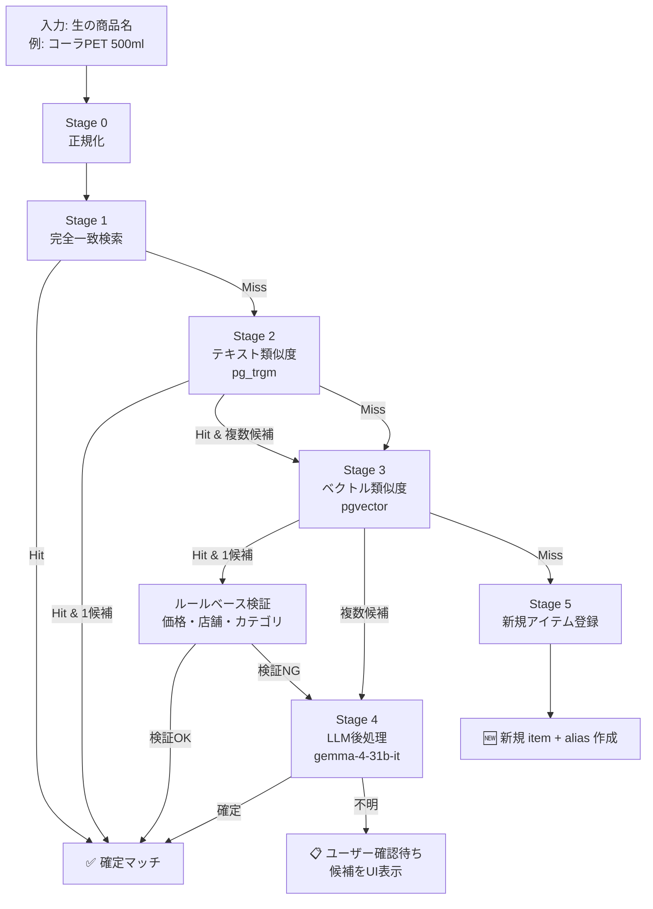
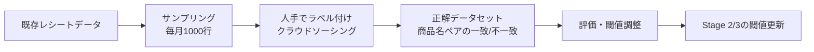
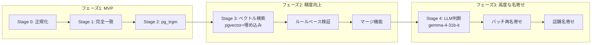

# 名寄せ（Entity Resolution）アルゴリズム設計
> **現行実装との対応**: この文書は本格的な商品名寄せの将来設計です。現在の商品マスタはレシート明細からブラウザ側で集計し、名称正規化・pg_trgm・pgvector・LLM名寄せの多段処理は未導入です。現行仕様は`00_現行実装仕様.md`を参照してください。

## 1. 課題定義

レシートから抽出される商品名には大量の表記揺れが存在する。

| 表記揺れの種類 | 例 | 同一商品 |
|---------------|-----|---------|
| 全角/半角 | コカ・コーラ５００ｍｌ vs コカ・コーラ500ml | ✅ |
| 大文字/小文字 | CocaCola vs Coca-Cola | ✅ |
| 略称 | コーラPET vs コカ・コーラ 500ml PET | ✅ |
| 単位表記 | 500ml vs 500ML vs 500ミリリットル | ✅ |
| スペース/記号 | トイレットペーパー12R vs トイレットペーパー 12R | ✅ |
| OCR誤認識 | トイレツトペーパー vs トイレットペーパー | ✅ |
| ブランド省略 | コーラ vs コカ・コーラ | ✅ |
| 商品名変更 | コカ・コーラ 500ml PET vs コカ・コーラ 500ml | ✅ |
| 数量セット | トイレットペーパー12R vs トイレットペーパー 6R×2 | ✅ |
| PB/GB品 | セブンプレミアム コーラ vs コカ・コーラ | ❌ 別商品 |

**目標**: 同じ商品を同一 `item_id` に束ね、別商品を誤統合しないこと。

---

## 2. 全体アーキテクチャ

### 多段階パイプライン（Cascade Architecture）



### 各ステージの役割と閾値

| Stage | 手法 | 閾値 | 処理時間 | 目的 |
|-------|------|------|---------|------|
| 0 | 正規化 | - | <1ms | 全角→半角、大文字→小文字、余分スペース除去 |
| 1 | 完全一致 | alias_name = 正規化名 | <1ms | 同一表記の再出現を即座に解決 |
| 2 | pg_trgm | 類似度 > 0.85 | 5-20ms | 軽微な表記揺れ・OCR誤認識を吸収 |
| 3 | ベクトル検索 | cosine > 0.90 | 10-50ms | 意味的に類似する商品名を検出 |
| 4 | LLM判断 | - | 100-500ms | 曖昧なケースの最終判断 |
| 5 | 新規登録 | - | 1ms | 未登録商品の初期化 |

---

## 3. Stage 0: 正規化（Normalization）

### 3.1 テキスト正規化パイプライン

```python
import re
import unicodedata

class ReceiptTextNormalizer:
    """レシート商品名の正規化パイプライン"""
    
    # レシート特有のノイズパターン
    NOISE_PATTERNS = [
        r'^\d{1,3}[\.\-)]\s*',          # 行番号 "1)" "2." 等
        r'[\(\（][^)]*[\)\）]?$',        # 末尾の注記
        r'※.*$',                        # 注釈
        r'^\*+\s*',                     # 先頭のアスタリスク
        r'¥\s*\d+',                     # 金額
        r'(\d{1,3}(,\d{3})+)(円)?',     # カンマ付き金額
    ]
    
    # よくある誤字パターン（OCR起因）
    OCR_CORRECTIONS = {
        'トイレツト': 'トイレット',
        'トイレツペーパー': 'トイレットペーパー',
        'ｺｰﾗ': 'コーラ',
        'シャンブー': 'シャンプー',
        'ニユウ': 'ニュウ',
        'キユウ': 'キュウ',
    }
    
    # 単位の正規化マップ
    UNIT_ALIASES = {
        'ｍｌ': 'ml', 'ML': 'ml', 'ミリリットル': 'ml',
        'ｇ': 'g', 'G': 'g', 'グラム': 'g',
        'ｋｇ': 'kg', 'KG': 'kg', 'キログラム': 'kg',
        'Ｌ': 'L', 'リットル': 'L',
        '本': '本', '個': '個', '枚': '枚', '袋': '袋',
    }
    
    def normalize(self, raw_name: str) -> str:
        """商品名を正規化する"""
        name = raw_name
        
        # 1. Unicode NFKC 正規化（全角→半角、特殊文字→標準）
        name = unicodedata.normalize('NFKC', name)
        
        # 2. 小文字化（ブランド名の表記揺れ対策）
        name = name.lower()
        
        # 3. ノイズ除去
        for pattern in self.NOISE_PATTERNS:
            name = re.sub(pattern, '', name)
        
        # 4. OCR誤字の修正
        for typo, correction in self.OCR_CORRECTIONS.items():
            name = name.replace(typo, correction)
        
        # 5. 単位の正規化
        for alias, standard in self.UNIT_ALIASES.items():
            name = name.replace(alias, standard)
        
        # 6. 余分な空白・記号を除去
        name = re.sub(r'\s+', '', name)           # 全空白除去
        name = re.sub(r'[・･･･]', '', name)        # 中点除去
        name = re.sub(r'[－−〜〜]', '-', name)      # 長音記号の正規化
        
        return name.strip()
    
    def extract_quantity_and_unit(self, raw_name: str) -> tuple[float, str, str]:
        """
        商品名から数量と単位を抽出する。
        例: "トイレットペーパー12R" -> (12, "R", "トイレットペーパー")
            "牛乳1L" -> (1, "L", "牛乳")
        """
        # 数量と単位のパターン (数字 + 単位)
        pattern = re.compile(
            r'(\d+(?:\.\d+)?)\s*(ml|L|l|g|kg|個|本|枚|袋|R|パック|缶|箱|丁|束)',
            re.IGNORECASE
        )
        match = pattern.search(raw_name)
        
        if match:
            qty = float(match.group(1))
            unit = match.group(2).lower()
            base_name = raw_name[:match.start()] + raw_name[match.end():]
            return qty, unit, base_name
        
        return 1.0, '個', raw_name
```

### 3.2 正規化の例

| 生の表記 | 正規化後 |
|----------|---------|
| コカ・コーラ５００ｍｌ | コカコーラ500ml |
| CocaCola 500ML | cocacola500ml |
| トイレツトペーパー12R | トイレットペーパー12r |
| 牛乳 1L | 牛乳1l |
| １．牛乳 | 牛乳 |
| トイレットペーパー 12R ※特売 | トイレットペーパー12r |

---

## 4. Stage 1-3: データベース検索

### 4.1 Stage 1: 完全一致検索

```python
def exact_match(normalized_name: str, user_id: str) -> ItemAlias | None:
    """完全一致で既存エイリアスを検索"""
    alias = db.query(ItemAlias).filter(
        ItemAlias.user_id == user_id,
        ItemAlias.normalized_name == normalized_name
    ).order_by(ItemAlias.occurrence_count.desc()).first()
    
    if alias:
        # 出現回数をインクリメント（高頻度アイテムを優先）
        ItemAlias.update(occurrence_count=alias.occurrence_count + 1,
                         last_seen_at=now())
    
    return alias
```

### 4.2 Stage 2: テキスト類似度検索（pg_trgm）

```python
from sqlalchemy import func

def fuzzy_match(normalized_name: str, user_id: str, threshold: float = 0.85):
    """pg_trgm でテキスト類似度検索"""
    candidates = db.query(
        ItemAlias,
        func.similarity(ItemAlias.normalized_name, normalized_name).label('sim')
    ).filter(
        ItemAlias.user_id == user_id,
        ItemAlias.normalized_name % normalized_name  # pg_trgm演算子
    ).order_by(
        func.similarity(ItemAlias.normalized_name, normalized_name).desc()
    ).limit(10).all()
    
    # 閾値フィルタ
    results = [c for c in candidates if c.sim >= threshold]
    return results
```

### 4.3 Stage 3: ベクトル類似度検索（pgvector）

#### 埋め込みモデルの選択

| モデル | 次元数 | 特徴 |
|--------|--------|------|
| `text-embedding-3-small` | 1536 | コスト最適・日本語対応 |
| `text-embedding-3-large` | 3072 | 高精度・コスト高 |
| `multilingual-e5-large` | 1024 | オープンソース・ローカル実行可能 |
| `bge-m3` | 1024 | 日本語特化・単語/文書/疎ベクトル対応 |

**推奨: `text-embedding-3-small` (1536次元)** — 精度・コスト・レイテンシのバランス最適。

```python
def vector_search(normalized_name: str, user_id: str, embedding, threshold: float = 0.90):
    """pgvector のコサイン類似度で検索"""
    candidates = db.query(
        ItemAlias,
        ItemAlias.embedding.cosine_distance(embedding).label('distance')
    ).filter(
        ItemAlias.user_id == user_id,
        ItemAlias.embedding.isnot(None)
    ).order_by(
        ItemAlias.embedding.cosine_distance(embedding)
    ).limit(10).all()
    
    results = [
        (alias, 1 - dist) for alias, dist in candidates
        if 1 - dist >= threshold  # コサイン類似度に変換
    ]
    return results
```

---

## 5. Stage 4: LLM後処理（ルールベース検証 + Gemma判断）

### 5.1 ルールベース検証（Stage 3の結果を絞り込む）

```python
class RuleBasedValidation:
    """候補アイテムのルールベース検証"""
    
    def validate(self, candidate_items: list[Item], 
                 raw_name: str, unit_price: int, store_name: str) -> list[Item]:
        """複数候補をルールで絞り込む"""
        validated = []
        
        for item in candidate_items:
            score = 0.0
            reasons = []
            
            # ルール1: 価格帯の整合性（同じ商品は同じ価格帯）
            price_range = self.get_price_range(item.id)
            if price_range:
                if price_range.min <= unit_price <= price_range.max * 1.5:
                    score += 0.3
                    reasons.append("価格帯一致")
                else:
                    score -= 0.5
                    reasons.append("価格帯不一致")
            
            # ルール2: カテゴリの整合性
            expected_category = self.get_item_category(item.id)
            predicted_category = self.predict_category(raw_name)
            if expected_category == predicted_category:
                score += 0.2
                reasons.append("カテゴリ一致")
            
            # ルール3: 購入店舗の整合性
            recent_stores = self.get_recent_stores(item.id)
            if store_name in recent_stores:
                score += 0.2
                reasons.append("購入店舗一致")
            
            # ルール4: 数量パターン
            qty, unit, _ = extract_quantity_and_unit(raw_name)
            if unit in self.get_item_units(item.id):
                score += 0.1
                reasons.append("単位パターン一致")
            
            validated.append((item, score, reasons))
        
        # スコアでソート
        validated.sort(key=lambda x: x[1], reverse=True)
        return validated
```

### 5.2 Gemma による LLM 判断

ベクトル検索やルールベースで候補が複数残る場合、**Gemma-4-31b-it をバッチ判断**に利用する。

```python
GEMELLA_RESOLUTION_PROMPT = """
あなたは商品名の名寄せ（Entity Resolution）の専門家です。

# 目的
新しいレシート商品名が、既存の商品マスタのいずれかに該当するかを判断してください。

# 入力
対象商品名: {new_name}
単価: {unit_price}円
購入店舗: {store_name}

既存アイテム候補:
{candidate_list}

# 出力（JSONのみ）
{
  "decision": "match" | "new_item" | "need_user_review",
  "matched_item_id": "UUID（matchの場合）",
  "confidence": 0.0-1.0,
  "reason": "判断理由（簡潔に日本語で）"
}

# 判断基準
- "match": 明らかに同一商品と判断できる場合
  - 例: "コーラPET 500ml" → "コカ・コーラ 500ml PET"
  - 例: "トイレットペーパー 12R" → "トイレツトペーパー12R"（OCR誤字）
- "new_item": どれとも同一でない場合
  - 例: "セブンプレミアム コーラ" → "コカ・コーラ"（別ブランド）
  - 例: "牛乳 900ml" → "牛乳 1L"（容量が異なる商品）
- "need_user_review": 判断が難しい場合
  - 例: "国産豚バラ切身 100g" → "豚バラ肉"（類似だが同一か不明）
"""

def llm_resolution(new_name: str, unit_price: int, store_name: str,
                   candidates: list[Item], model: GenerativeModel) -> LLMDecision:
    """Gemma-4-31b-it で名寄せ判断を行う"""
    
    # 候補リストを整形
    candidate_list = "\n".join([
        f"- id: {item.id}, 商品名: {item.canonical_name}, "
        f"価格帯: {get_price_range(item.id)}, カテゴリ: {get_category(item.id)}"
        for item in candidates
    ])
    
    prompt = GEMELLA_RESOLUTION_PROMPT.format(
        new_name=new_name,
        unit_price=unit_price,
        store_name=store_name,
        candidate_list=candidate_list
    )
    
    response = model.generate_content(
        prompt,
        generation_config=genai.types.GenerationConfig(
            temperature=0.0,  # 決定論的な判断
            response_mime_type="application/json",
        )
    )
    
    return LLMDecision.model_validate_json(response.text)
```

---

## 6. Stage 5: 新規アイテム登録

```python
def register_new_item(user_id: str, raw_name: str, category: str,
                      unit_price: int, embedding: list[float]) -> Item:
    """新しいアイテムとエイリアスを登録"""
    
    # 商品名から数量・単位を抽出
    qty, unit, base_name = extract_quantity_and_unit(raw_name)
    normalized = normalize(raw_name)
    
    # 商品名の正規化（代表名の決定）
    canonical_name = generate_canonical_name(base_name, unit, qty)
    
    with db.transaction():
        # アイテム作成
        item = Item(
            user_id=user_id,
            canonical_name=canonical_name,
            display_name=base_name,
            unit=unit,
            embedding=embedding,
        )
        db.add(item)
        db.flush()
        
        # エイリアス作成
        alias = ItemAlias(
            item_id=item.id,
            alias_name=raw_name,
            normalized_name=normalized,
            embedding=embedding,
            confidence=1.0,
            occurrence_count=1,
            last_seen_at=now(),
        )
        db.add(alias)
        
        # カテゴリ紐付け
        db.add(ItemCategory(
            item_id=item.id,
            category_id=get_category_id(category),
            confidence=0.9,
        ))
    
    return item
```

---

## 7. マージ処理（誤った名寄せの修正）

### 7.1 アイテムの統合（マージ）

```sql
-- 誤って別アイテムになっていた場合のマージ処理
-- 例: item A "コーラPET" と item B "コカ・コーラ 500ml" が同一と判明

BEGIN;

-- Step 1: line_items の参照をAからBに付け替え
UPDATE line_items 
SET item_id = :target_item_id  -- B
WHERE item_id = :source_item_id;  -- A

-- Step 2: price_history を移行
UPDATE price_history
SET item_id = :target_item_id
WHERE item_id = :source_item_id;

-- Step 3: エイリアスを移行
UPDATE item_aliases
SET item_id = :target_item_id
WHERE item_id = :source_item_id;

-- Step 4: カテゴリを統合
INSERT INTO item_categories (item_id, category_id, confidence)
SELECT :target_item_id, category_id, MAX(confidence)
FROM item_categories
WHERE item_id IN (:source_item_id, :target_item_id)
GROUP BY category_id
ON CONFLICT (item_id, category_id) DO NOTHING;

-- Step 5: 旧アイテムをmergedとしてマーク
UPDATE items
SET status = 'merged',
    merged_into_id = :target_item_id,
    merged_at = NOW()
WHERE id = :source_item_id;

COMMIT;
```

### 7.2 マージ実施のトリガー

| トリガー | 説明 |
|----------|------|
| ユーザー操作 | アプリのUIで「この商品は同一」ボタン |
| バッチ分析 | 深夜ジョブで同一性の高い未解決ペアを検出 |
| PPCPチェック | 同一価格・同一店舗・同一カテゴリで2回以上出現 |
| 低頻度アイテム | 1回しか出現せず類似度の高いアイテムが存在 |

---

## 8. バッチ再名寄せ（オフライン一括処理）

リアルタイム処理だけでなく、**夜間バッチ**で過去データの再名寄せを行う。

```python
def batch_reconciliation(user_id: str):
    """未解決アイテムの再名寄せバッチ"""
    
    # Step 1: 未解決のline_itemsを抽出
    unresolved = db.query(LineItem).filter(
        LineItem.user_id == user_id,
        LineItem.item_id.is_(None)  # 名寄せ未解決
    ).all()
    
    # Step 2: クラスタリングで候補グループを生成
    clusters = clustering_by_embedding(unresolved, eps=0.85)
    
    # Step 3: 各クラスタで代表アイテムを決定
    for cluster in clusters:
        if len(cluster) >= 2:
            canonical = determine_canonical_item(cluster)
            for item in cluster:
                if item.id != canonical.id:
                    merge_items(canonical.id, item.id)
    
    # Step 4: ユーザー確認が必要なペアを抽出
    review_needed = identify_review_needed_pairs()
    for pair in review_needed:
        notify_user(pair)
```

### クラスタリング手法

```python
from sklearn.cluster import DBSCAN

def clustering_by_embedding(items: list[Item], eps: float = 0.85):
    """
    埋め込みベクトルで商品をクラスタリング。
    DBSCAN は密度ベースでクラスタ数を事前指定不要。
    """
    # 埋め込みベクトルを取得
    X = np.array([item.embedding for item in items])
    
    # DBSCAN クラスタリング
    clustering = DBSCAN(
        eps=eps,
        min_samples=2,
        metric='cosine'
    ).fit(X)
    
    clusters = {}
    for item, label in zip(items, clustering.labels_):
        if label != -1:  # -1はノイズ（孤立点）
            clusters.setdefault(label, []).append(item)
    
    return list(clusters.values())
```

---

## 9. 精度評価と改善サイクル

### 9.1 評価指標

| 指標 | 定義 | 目標値 |
|------|------|--------|
| Precision | 誤統合の少なさ (別商品を同一と判別しない) | 95%以上 |
| Recall | 見逃しの少なさ (同一商品を別々にしない) | 92%以上 |
| F1 | PrecisionとRecallの調和平均 | 93%以上 |
| 手動修正率 | ユーザーが修正した割合 | 5%以下 |
| 解決率 | 名寄せされたレシート行の割合 | 98%以上 |

### 9.2 グラウンドトゥルースの構築



### 9.3 評価データセット

```python
# 評価用データセットの例
EVALUATION_PAIRS = [
    # (商品A, 商品B, 正解: is_same)
    ("コカ・コーラ 500ml", "コーラPET", True),
    ("トイレットペーパー 12R", "トイレットペーパー12R", True),
    ("牛乳 1L", "牛乳 900ml", False),
    ("セブンプレミアム コーラ", "コカ・コーラ", False),
    ("シャンプー詰替 つめかえ用", "シャンプー詰め替え", True),
    ("国産豚バラ切り落とし100g", "豚バラ肉", False),
    ("コカ・コーラ５００ｍｌ", "コカコーラ500ml", True),
    ("CocaCola 500ML", "コカ・コーラ 500ml", True),
    ("マスク 30枚入", "マスク30枚", True),
    ("ビール350ml 6缶パック", "発泡酒350ml 6缶", False),
]

def evaluate_resolution(algorithm_fn, pairs=EVALUATION_PAIRS):
    tp = fp = tn = fn = 0
    for name_a, name_b, is_same in pairs:
        result = algorithm_fn(name_a, name_b)
        if result and is_same: tp += 1
        elif result and not is_same: fp += 1
        elif not result and is_same: fn += 1
        else: tn += 1
    
    precision = tp / (tp + fp)
    recall = tp / (tp + fn)
    f1 = 2 * precision * recall / (precision + recall)
    
    return {"precision": precision, "recall": recall, "f1": f1}
```

---

## 10. 店舗名の名寄せ

商品名だけでなく、**店舗名も名寄せする**ことで、店舗別の価格比較が可能になる。

```python
def normalize_store_name(raw_name: str) -> str:
    """店舗名の正規化"""
    name = unicodedata.normalize('NFKC', raw_name).lower()
    
    # 住所・電話番号の除去
    name = re.sub(r'\d{2,4}-\d{2,4}-\d{4}', '', name)  # TEL
    name = re.sub(r'[東京都大阪府].*?[0-9]+-[0-9]+', '', name)  # 住所
    
    # チェーン名の統一
    CHAIN_MAP = {
        'セブンイレブン': 'セブンイレブン',
        '7-eleven': 'セブンイレブン',
        '7eleven': 'セブンイレブン',
        'マルエイ': 'マルエイ',
        'サンドラッグ': 'サンドラッグ',
        'sundrug': 'サンドラッグ',
    }
    
    # 店舗名の部分一致でチェーンを特定
    for chain_name, canonical in CHAIN_MAP.items():
        if chain_name.lower() in name:
            return canonical
    
    return name
```

**設計として:** `receipts.store_name` は表示用に生値を保持し、別途 `store_masters` テーブルで店舗マスタを管理する。

```sql
CREATE TABLE store_masters (
    id            UUID PRIMARY KEY DEFAULT gen_random_uuid(),
    chain_name    VARCHAR(200) NOT NULL,    -- チェーン名（正規化後）
    display_name  VARCHAR(200) NOT NULL,    -- 表示名
    prefecture    VARCHAR(20),
    created_at    TIMESTAMPTZ NOT NULL DEFAULT NOW()
);

ALTER TABLE receipts ADD COLUMN store_id UUID REFERENCES store_masters(id);
```

---

## 11. まとめ：実装優先順位



### 実装チェックリスト

| 優先度 | タスク | 効果 |
|--------|--------|------|
| 🔴 高 | 正規化パイプライン | 全表記揺れの60%を解決 |
| 🔴 高 | 完全一致 + pg_trgm | 追加で25%を解決 |
| 🟡 中 | ベクトル検索 | 意味的類似（略称等）を解決 |
| 🟡 中 | ルールベース検証 | 誤統合を防止 |
| 🟢 低 | LLM判断 | 残り5%の曖昧ケースを解決 |
| 🟢 低 | マージ・再名寄せ | 長期の精度維持 |